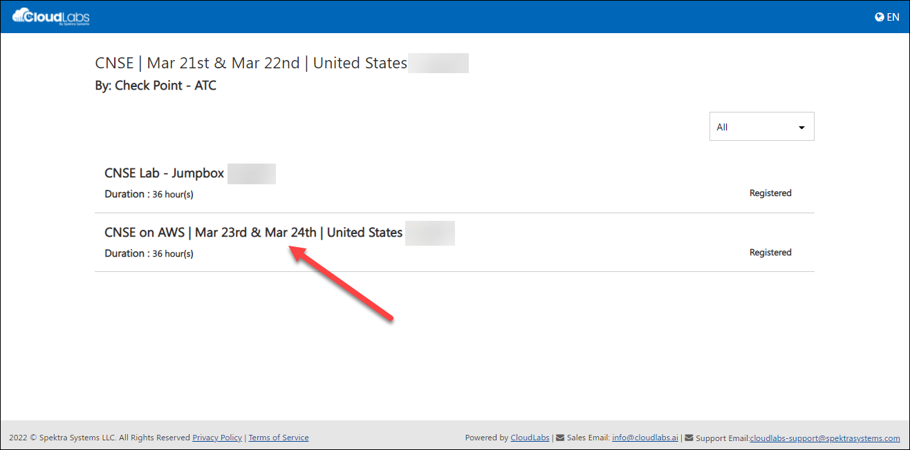
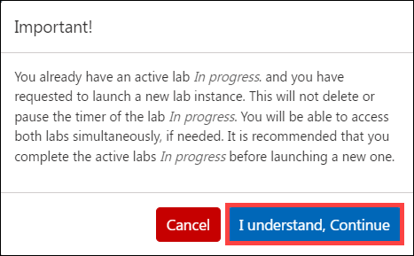
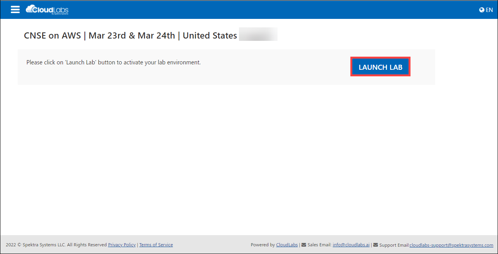
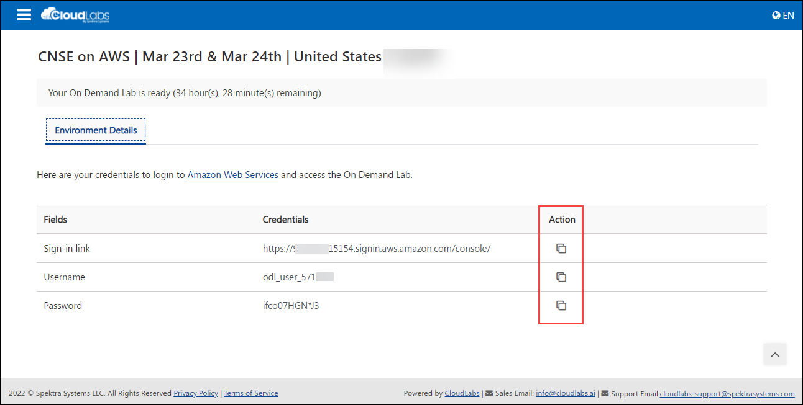

# Steps to be followed by the user to activate and access lab on AWS.

Step **1**: Once user is done with the Azure lab, user can go back to the previous tab and "click" on the AWS lab name (CNSE on AWS)

Step **2**: The user will get a pop up similar to the image below, please click on **I Understand, continue**.

Step **3**: Now click on **LAUNCH LAB** button to activate the lab environment.

Step **4**:	The user can now use the given Sign-in link, Username, and Password to login to the AWS console.

 
